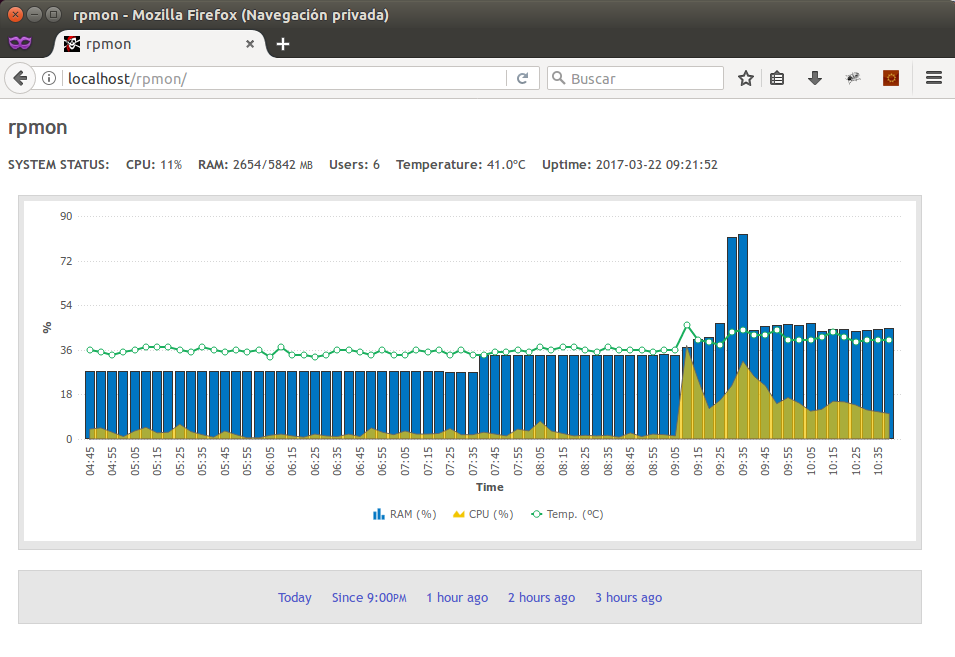

RPMON
=====

Monitor de estado para sistemas basados en Debian (Ubuntu, Raspbian, etc). Guarda el uso de RAM, de CPU y la temperatura de esta. Lo muestra en gráficos haciendo uso de FusionCharts.


Instalación
-----------

* Hay que ejecutar el script sql (*rpmon.sql*) en una base de datos y configurar el archivo *bbdd.php* con los datos de acceso.

* Para controlar la temperatura en Ubuntu hay que instalar los sensores:
```
		sudo apt-get install lm-sensors
		sudo sensors-detect
```

* Probado en Raspbian y Ubuntu.


Screenshot
----------




© [MdeMoUcH](http://www.twitter.com/mdemouch) | [La Gran M](http://www.lagranm.com) | [Ubuntu Fácil](http://www.ubuntufacil.com)